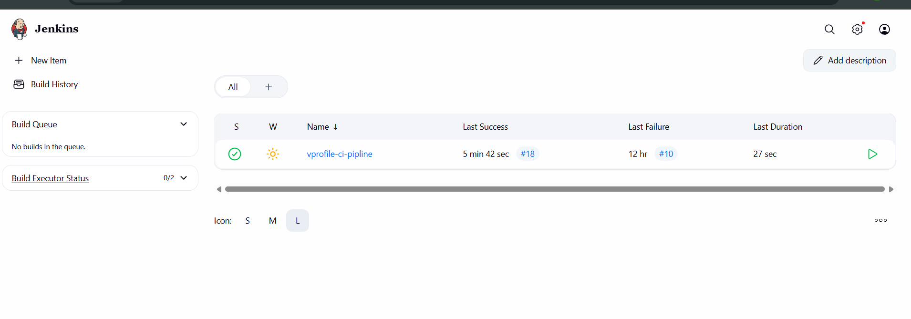
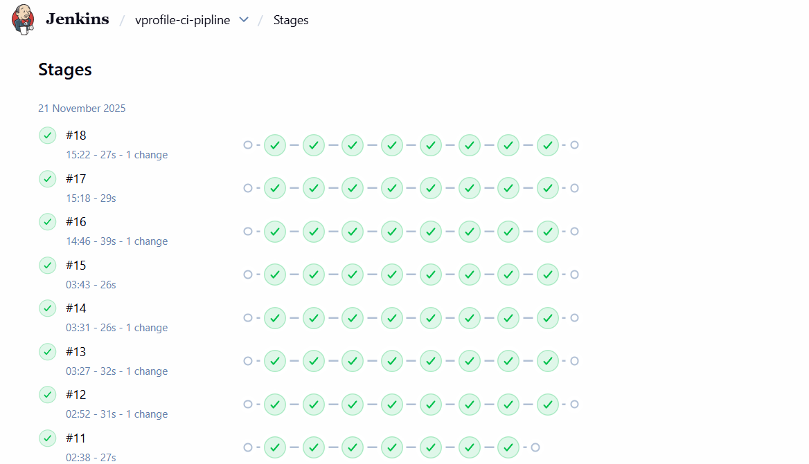
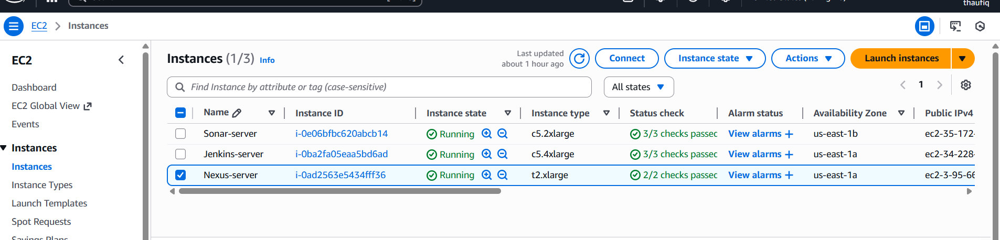
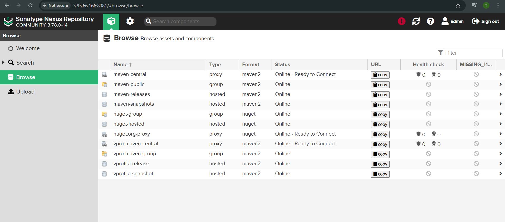
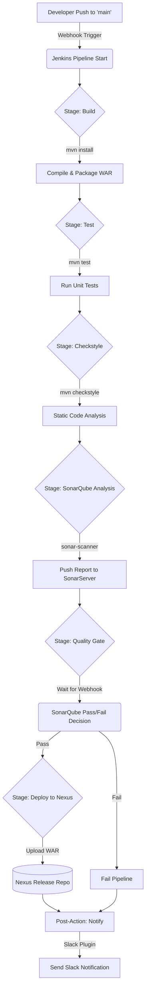
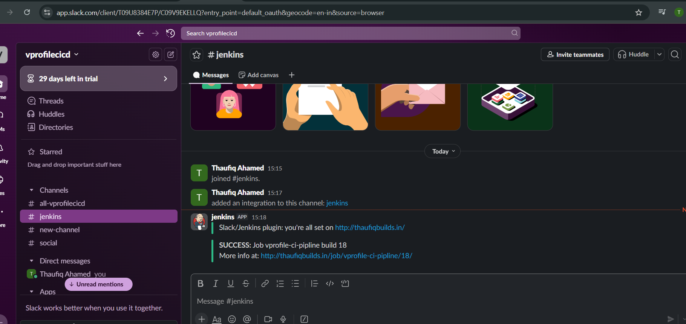

# vprofile-app Continuous Integration Pipeline

The **vprofile-app** is a Java-based application compatible with Java 17 and 21. This repository contains the source code and the Jenkins pipeline configuration used to automate the continuous integration (CI) lifecycle.

This documentation focuses solely on the automated CI process managed by Jenkins, detailing how code commits are automatically triggered, built, tested, analyzed for quality, and published as deployable artifacts.

## CI Pipeline Overview

The Continuous Integration pipeline is orchestrated by Jenkins and is designed to ensure code quality and build integrity with every change.

**Jenkins Job Dashboard:**

**Current Pipeline Status Visualization:**

The pipeline performs the following key actions:

* Automated compilation and building of the Java application with Maven.
* Execution of unit tests.
* Static code analysis using Checkstyle.
* Comprehensive code quality and security scanning via SonarQube.
* Enforcement of quality gates before proceeding.
* Publishing the final versioned artifact (WAR file) to a Sonatype Nexus repository.
* Sending real-time build status notifications to a Slack channel.

## Infrastructure & Technology Stack

The CI/CD infrastructure is hosted on AWS EC2 instances, connecting various DevOps tools.

| Category             | Tool             | Description                                                                |
| :------------------- | :--------------- | :------------------------------------------------------------------------- |
| **Cloud Provider**   | AWS EC2          | Hosts the Jenkins, SonarQube, and Nexus servers.                           |
| **CI Orchestration** | Jenkins          | Manages the entire automated pipeline flow.                                |
| **Build Tool**       | Apache Maven 3.9 | Handles project building, dependency management, and testing.              |
| **Language Runtime** | Java 17          | Jenkins uses JDK 17 for build tasks.                                       |
| **Code Quality**     | SonarQube        | Performs static analysis to detect bugs, vulnerabilities, and code smells. |
| **Artifact Repo**    | Sonatype Nexus   | Stores dependencies and hosts the final deployable build artifacts.        |
| **Notifications**    | Slack            | Provides instant alerts on pipeline success or failure.                    |

**Nexus Repository Configuration:**

## Pipeline Trigger & Automation

This pipeline adheres to Continuous Integration principles by automating builds on every significant code change.

* **Trigger Mechanism:** Source Code Management (SCM) Webhook.
* **Trigger Events:** A `push` or `commit` event to the repository.
* **Target Branch:** The pipeline is configured to trigger automatically only on changes made to the **`main`** branch.

Whenever code is merged or pushed to the `main` branch, a webhook notifies Jenkins, which immediately initiates the pipeline execution process defined below.

## Pipeline Architecture Diagram

The following diagram illustrates the flow of execution defined in the `Jenkinsfile`:

## Detailed Pipeline Stages

The Jenkinsfile defines a declarative pipeline with the following distinct stages:

### 1. Build

**Tool:** Maven

**Command:** `mvn -s settings.xml -DskipTests install`

**Description:** Compiles the source code, downloads dependencies from the Nexus group repository, and packages the application into a `.war` file. Tests are skipped to speed up the build.

**Post-Action:** Generated WAR file (`/target/*.war`) is archived as a Jenkins artifact.

### 2. Test

**Tool:** Maven

**Command:** `mvn -s settings.xml test`

**Description:** Runs all unit tests.

### 3. Checkstyle

**Tool:** Maven Checkstyle Plugin

**Command:** `mvn -s settings.xml checkstyle:checkstyle`

**Description:** Performs static analysis using coding standard rules.

### 4. SonarQube Analysis

**Tool:** SonarScanner

**Description:** SonarScanner analyzes the codebase, JaCoCo coverage, and Checkstyle reports, then publishes results to the SonarQube server.

### 5. Quality Gate

**Description:** Pipeline waits for SonarQube's webhook callback. If the project meets quality gate conditions, pipeline continues; otherwise, it fails.

### 6. Deploy to Nexus

**Tool:** Nexus Artifact Uploader Plugin

**Description:** The final `vprofile-v2.war` is versioned with build ID + timestamp and uploaded to the Nexus release repository.

**Successfully Uploaded Artifacts in Nexus:**
(Include relevant screenshots here.)

## Slack Notifications

The pipeline sends real-time notifications to the **#jenkins** Slack channel.

**Success Notification:**

**Failure Notification:**

Notifications include:

* Build number
* Build status
* Link to the Jenkins console

## Environment Configuration

Security-sensitive values are securely managed using Jenkins Credentials.

* **NEXUS_LOGIN:** Credentials ID for Nexus authentication.
* **SONARSERVER / SONARSCANNER:** Configured Jenkins tools for Sonar.
* **NEXUSIP / NEXUSPORT:** Stored as environment variables for flexible deployments.

---

